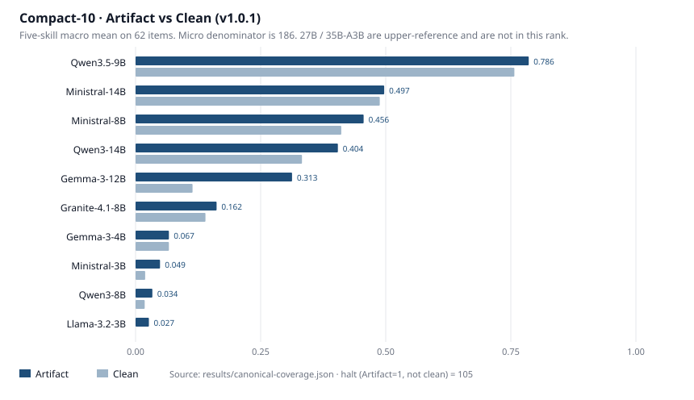

# Small-OW-Agent-Bench

**简体中文** | [English](README_EN.md)

[](results/leaderboard.md)
[](LICENSE)
[](https://huggingface.co/datasets/junjun77/small-ow-agent-bench)
[](https://github.com/caojiajun777/small-ow-agent-bench)

> 一台家用主机上的小模型，能接住多少 Coding Agent 的工作？

Coding Agent 花钱的地方不只在最后那段答案。为了改三行代码，它可能要先扫目录、读文件、运行测试、修改代码，再把测试跑一遍，整条操作轨迹都在消耗 token。难题值得交给最强的模型，但工程任务并不都难到同一个程度。找文件、修一处局部逻辑、补几条测试或复现一个 Bug，范围明确，结果也能直接验证。如果小模型做得来，每次都调用最高规格的 API 就未必划算。

开放权重模型还可以留在本地或公司内网。代码不必发给外部服务，模型版本可以固定，也方便量化和定制；团队不再按调用量支付 API 费用，也不会受第三方限流影响。榜单中的 16 个配置总参数量介于 3B 和 35B。经过合适的低比特量化，它们都能在一台内存或显存足够的家用高性能主机或个人工作站上运行，不需要多机服务器、专用集群或定制加速器。3B 至 14B 的部署门槛较低，20B 至 35B 则需要更多内存或显存。

当然，本地部署也有硬件和运维成本。模型如果做不对，省下来的 API 费用没有意义。我们做 Small-OW-Agent-Bench，就是想把问题先问清楚：这些能在个人设备上部署的小模型，究竟能完成哪些 Coding Agent 任务；做不出来时，又卡在哪一步？

评测包含 62 道自动判分的代码任务，题目中保留了软件工程里常见的陷阱。我们测试了 16 个开放权重模型配置，每个模型在每道题上独立运行 3 次，共完成 2,976 次沙箱实验。这套题既可以比较现有模型，也可以继续接入以后发布的模型，找出它们擅长和薄弱的环节，为后训练和 Coding 能力改进提供依据。

仓库包含从题库到榜单的完整评测链路：任务与隐藏验证器、Docker 沙箱、终端 Agent、模型和 API 配置锁、批量运行、基础设施故障替换、难度元数据、计分脚本与结果图表。榜单中的每个数字都能回到具体的模型、任务和重复实验，而不是手工填写的汇总值。

## 为什么用代码来测

因为代码可以直接运行，答案对不对可以交给程序验收。模型要进入终端、阅读仓库、修改文件、运行测试，还要根据反馈调整做法，并在任务完成后停下来。这些动作串在一起，正好构成一个 Coding Agent 的基本工作循环。评分只看最后留下的结果，不看回答写得是否漂亮，也不需要另一个 LLM 充当裁判。

这只是观察通用智能的一个窄窗口。它测的是模型能否在一批可执行、有反馈、能验收的软件工程任务中完成工作，不是一套 AGI 测试。

## 我们怎么拆任务

一次失败可能有很多原因：文件找错了、代码没改对、测试没写好，或者任务已经完成，Agent 却没有停下来。单个 Pass/Fail 看不出问题出在哪，所以我们把工作流程拆成五个可以单独验收的环节：

| 任务 | 模型要做什么 | 怎样算成功 |
|---|---|---|
| 找文件（Localization） | 根据问题描述找出需要修改的文件 | 文件一个不能少，也不能多报 |
| 修改代码（Editing） | 已经告诉目标文件，完成指定修改 | 隐藏测试全部通过 |
| 编写测试（Test Generation） | 为给定函数编写测试 | 正确实现通过，错误实现被测试发现 |
| 复现 Bug（Reproduction） | 编写能稳定触发问题的复现程序 | 修复前失败，修复后成功 |
| 判断补丁（Patch Validation） | 判断给出的补丁是否真的解决问题 | 输出的判断与标准答案一致 |

五列分别对应定位、实现、测试、复现和补丁判断。两个总分相近的模型，短板可能完全不同。

## 两个分数

代码改对了，不代表 Agent 完整走完了流程。我们分别记录结果和过程。

| 通俗名称 | 技术名称 | 意思 |
|---|---|---|
| **结果分** | Artifact Score | Agent 最终是否留下正确结果，按题目构造难度加权 |
| **完整分** | Clean Score | 结果正确，而且 Agent 正常宣布完成并停止，同样按难度加权 |

例如，Agent 已经正确修改了文件，却继续反复运行测试，直到 20 轮预算耗尽。这次尝试算作一次 Artifact 命中，但不算 Clean 完成。下文把这种情况叫作 `做对但没停`。

每道题的三次结果先取平均；Easy、Medium、Hard 的构造难度权重分别为 1、1.5、2。排行榜先在每类能力内部加权，再将五类能力等权平均，得到满分 100 的总分。榜单同时保留未经加权的原始成功次数，便于核对。

## 为什么这些题能分出差异

题目难只是一个条件。更重要的是，分数差异要能指向具体行为，评分还要经得起重复检查。

五类任务各有明确的输入和产物。找文件只提交文件集合；修改代码会直接给出目标文件；编写测试不能改实现；复现 Bug 不能修仓库；判断补丁只提交判断结果。验收规则同样具体：文件集合必须完全一致，多报一个相似文件也算错；代码修改必须通过隐藏测试；生成的测试既要放过正确实现，也要找出人为构造的错误实现；Bug 复现要在修复前失败、应用标准补丁后通过；补丁判断则与固定标签核对。每套评分程序都经过标准解和空操作基线检查，标准解必须通过，什么都不做必须失败。

62 道题围绕五类能力中的常见失败陷阱设计，每个陷阱用一到两个短任务呈现。出题时冻结的构造难度为 Easy 17、Medium 21、Hard 24，它决定计分权重。跑完后，我们再用同一批模型标定任务的实际位置，得到 Easy 12、Medium 38、Hard 7、Out-of-range 5。经验标签只用于校准，不会反过来改写作者难度；5 道 Out-of-range 在出题时都是 Hard，仍按 Hard 权重计分。

每个 `模型配置 × 任务` 组合在独立沙箱中运行 3 次，Agent 接口、20 轮预算、隐藏验证器和评分规则保持不变。API 或平台故障不算模型失败；选错文件、产物错误、格式错误、耗尽预算和未正常结束仍按协议计分。

为了检查这套分级是否真的落在数据上，我们又做了 1PL Rasch 分析。作者难度与数据估计难度的 Spearman 相关为 0.58，Easy、Medium、Hard 的平均通过率依次为 50.2%、37.8%、26.5%，三档在整体上保持了预期顺序。IRT 只用于检查题目，不参与排行榜计分，完整结果见 [`DIFFICULTY.md`](DIFFICULTY.md)。

Artifact 看模型留下了什么，Clean 再看它是否正常停下。排行榜比较的是冻结 compact-shell 协议下的完整系统配置，不能把分数脱离 API 供应商、推理参数和 Agent 接口解释为模型权重本身的能力。

## 排行榜（v1.0.1）

16 个配置放在同一张表中，按 Artifact Score 排序。深色条是结果分，浅色条是完整分；两者之间的差距，就是模型已经留下正确产物，却没有正常结束的实验。



| 模型 | Artifact Score | Clean Score |
|---|---:|---:|
|  Qwen3.8-27B | 83.8 | 81.8 |
|  Qwen3.5-9B | 77.3 | 74.3 |
|  Qwen3.6-35B-A3B | 59.5 | 51.7 |
|  GLM-4.7-Flash | 51.3 | 39.1 |
|  GPT-OSS-20B | 47.9 | 40.2 |
|  Ministral-14B | 46.9 | 46.2 |
|  Ministral-8B | 43.2 | 38.7 |
|  Qwen3-14B | 39.0 | 31.8 |
|  Nemotron-3.5-Lightning | 34.7 | 9.2 |
|  Gemma-3-12B | 30.2 | 11.0 |
|  Granite-4.1-8B | 15.2 | 13.4 |
|  Gemma-4-26B-A4B | 13.1 | 13.1 |
|  Gemma-3-4B | 6.8 | 6.8 |
|  Ministral-3B | 4.7 | 1.7 |
|  Qwen3-8B | 2.5 | 1.5 |
|  Llama-3.2-3B | 2.1 | 0.0 |

Qwen3.6-35B-A3B 是约 3B 激活的 MoE，不能把它当成 27B dense 的下一档。表格只按实测分数排序，与参数量顺序无关。

五列分数是每类能力内部按 Easy 1、Medium 1.5、Hard 2 加权后的 0–100 分；加权总分是五列等权平均。完整表、原始成功次数和 Clean 分五列见 [`results/leaderboard.md`](results/leaderboard.md)。

### 结果分（五类能力）

| 模型 | 找文件 | 修改代码 | 编写测试 | 复现 Bug | 判断补丁 | 加权总分 |
|---|---:|---:|---:|---:|---:|---:|
|  Qwen3.8-27B | 52.1 | 96.4 | 90.7 | 84.1 | 95.8 | **83.8** |
|  Qwen3.5-9B | 28.2 | 89.2 | 93.0 | 76.2 | 100.0 | 77.3 |
|  Qwen3.6-35B-A3B | 33.3 | 53.2 | 90.7 | 45.2 | 75.0 | 59.5 |
|  GLM-4.7-Flash | 2.6 | 71.2 | 36.4 | 64.3 | 82.3 | 51.3 |
|  GPT-OSS-20B | 17.9 | 36.0 | 35.7 | 73.0 | 77.1 | 47.9 |
|  Ministral-14B | 7.7 | 61.3 | 2.3 | 81.0 | 82.3 | 46.9 |
|  Ministral-8B | 13.7 | 61.3 | 30.2 | 55.6 | 55.2 | 43.2 |
|  Qwen3-14B | 7.7 | 40.5 | 44.2 | 42.1 | 60.4 | 39.0 |
|  Nemotron-3.5-Lightning | 5.1 | 66.7 | 64.3 | 11.1 | 26.0 | 34.7 |
|  Gemma-3-12B | 0.0 | 48.6 | 16.3 | 40.5 | 45.8 | 30.2 |
|  Granite-4.1-8B | 0.0 | 34.2 | 7.0 | 4.8 | 30.2 | 15.2 |
|  Gemma-4-26B-A4B | 4.3 | 18.9 | 15.5 | 27.0 | 0.0 | 13.1 |
|  Gemma-3-4B | 0.0 | 8.1 | 0.0 | 0.0 | 26.0 | 6.8 |
|  Ministral-3B | 2.6 | 11.7 | 9.3 | 0.0 | 0.0 | 4.7 |
|  Qwen3-8B | 7.7 | 0.0 | 0.0 | 4.8 | 0.0 | 2.5 |
|  Llama-3.2-3B | 0.0 | 0.0 | 0.0 | 0.0 | 10.4 | 2.1 |

### 完整分（五类能力）

完整分要求产物正确，并且 Agent 正常宣布完成。行序与结果分表相同。

| 模型 | 找文件 | 修改代码 | 编写测试 | 复现 Bug | 判断补丁 | 加权总分 |
|---|---:|---:|---:|---:|---:|---:|
|  Qwen3.8-27B | 41.9 | 96.4 | 90.7 | 84.1 | 95.8 | 81.8 |
|  Qwen3.5-9B | 28.2 | 83.8 | 93.0 | 66.7 | 100.0 | 74.3 |
|  Qwen3.6-35B-A3B | 33.3 | 53.2 | 90.7 | 6.3 | 75.0 | 51.7 |
|  GLM-4.7-Flash | 2.6 | 71.2 | 36.4 | 3.2 | 82.3 | 39.1 |
|  GPT-OSS-20B | 17.9 | 16.2 | 25.6 | 64.3 | 77.1 | 40.2 |
|  Ministral-14B | 7.7 | 57.7 | 2.3 | 81.0 | 82.3 | 46.2 |
|  Ministral-8B | 8.5 | 50.5 | 27.1 | 52.4 | 55.2 | 38.7 |
|  Qwen3-14B | 7.7 | 40.5 | 44.2 | 40.5 | 26.0 | 31.8 |
|  Nemotron-3.5-Lightning | 2.6 | 9.0 | 21.7 | 3.2 | 9.4 | 9.2 |
|  Gemma-3-12B | 0.0 | 0.0 | 7.0 | 2.4 | 45.8 | 11.0 |
|  Granite-4.1-8B | 0.0 | 25.2 | 7.0 | 4.8 | 30.2 | 13.4 |
|  Gemma-4-26B-A4B | 4.3 | 18.9 | 15.5 | 27.0 | 0.0 | 13.1 |
|  Gemma-3-4B | 0.0 | 8.1 | 0.0 | 0.0 | 26.0 | 6.8 |
|  Ministral-3B | 0.0 | 3.6 | 4.7 | 0.0 | 0.0 | 1.7 |
|  Qwen3-8B | 7.7 | 0.0 | 0.0 | 0.0 | 0.0 | 1.5 |
|  Llama-3.2-3B | 0.0 | 0.0 | 0.0 | 0.0 | 0.0 | 0.0 |

## 这张榜怎么用

这张榜更适合用来做模型路由，而不是简单挑一个总分最高的模型。先看五类任务的分数，再按实际工作选择候选模型。范围小、调用频繁、能够自动验收的任务，可以先交给小模型，再用测试或确定性规则检查；没有通过验证或风险较高的任务，再升级给更强的模型或人工处理。榜单不能替团队划定风险边界，但可以帮助团队决定先试哪个模型。

## 口径和限制

所有实验都在独立的 Linux Docker 沙箱中运行。模型看不到隐藏测试，最多进行 20 轮终端交互。为了让不同模型面对同一套环境，我们写死了 API 线路、推理参数、Agent 接口、工具权限和轮次预算。站在 Agent 的角度，这和把模型接到本地推理服务上很接近：它看到同一个仓库，使用同一套终端工具，接收同样的执行反馈，最后提交同一种产物。API 只负责推理，不参与任务执行和评分。因此，这张榜能够反映固定协议下的端到端 Agent 能力，也可以作为本地部署前筛选模型的依据。完整协议、16 个模型配置和复现入口见 [`STANDARD.md`](STANDARD.md)。

API 与本地运行的主要差别留在推理后端。量化方式、推理引擎、上下文实现和硬件配置都可能影响输出、速度和成本，v1.0.1 没有统一测量这些变量，也没有把最强闭源模型放进同一协议对照。所以这是一份能力与可靠性榜单，不是价格性能榜，也不用于证明小模型已经达到闭源前沿模型的能力。要比较完整的本地性价比，还需要把 GPU 成本、吞吐量、延迟、利用率和单位成功任务成本一起算进去。

<details>
<summary>运行一个任务</summary>

沙箱使用 Novita，Agent 使用 compact-shell。先把 `.env.example` 复制为 `.env`，不要提交 `.env`。如果已有评测任务在运行，请等它结束后再启动下一条。

```powershell
$env:PYTHONIOENCODING = "utf-8"
$env:PYTHONPATH = (Get-Location).Path

harbor run --env-file .env -o jobs -p ./tasks/loc-member-discount `
  -a agents.compact_shell:CompactShellAgent `
  -m openrouter/qwen/qwen3.5-9b -k 1 -n 1 -e novita `
  --ak 'llm_call_kwargs={"extra_body":{"enable_thinking":false}}'

python scripts/score_standard.py jobs/<job>
```

批量运行入口：`python scripts/run_locked.py`（见 [`STANDARD.md`](STANDARD.md)）。不要覆盖 `jobs/locked-core.json`、`jobs/locked-core-k3.json`、`jobs/locked-hard-release-k3.json`。

</details>
