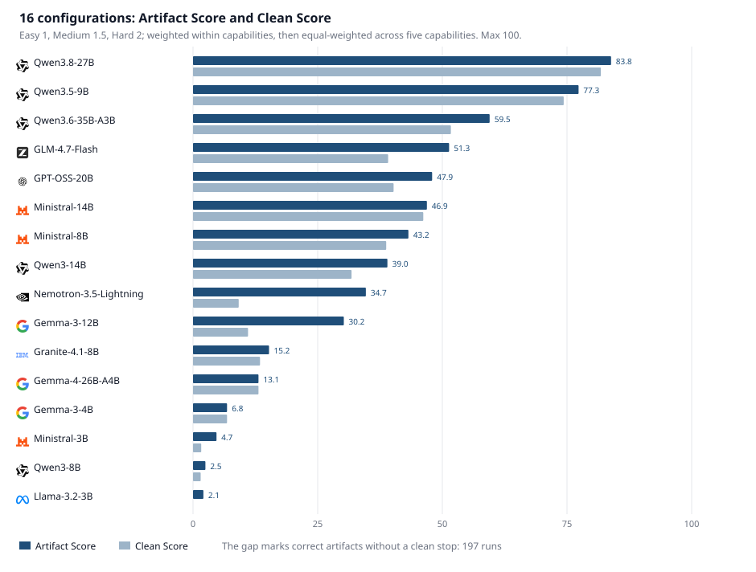

# Small-OW-Agent-Bench

[简体中文](README.md) | **English**

[](results/leaderboard.md)
[](LICENSE)
[](https://huggingface.co/datasets/junjun77/small-ow-agent-bench)
[](https://github.com/caojiajun777/small-ow-agent-bench)

> How much Coding Agent work can small models handle on a home machine?

The cost of a Coding Agent is not limited to its final answer. To change three lines of code, it may first scan directories, read files, run tests, edit code, and run the tests again. Every step in that trajectory consumes tokens. The hardest problems deserve the strongest models, but engineering tasks do not all have the same level of difficulty. Finding a file, fixing a small piece of logic, adding a few tests, or reproducing a bug all have clear scopes and directly verifiable outcomes. If a small model can do the job, calling the most capable API every time may not be cost-effective.

Open-weight models can also stay on a local machine or inside a company network. Code does not need to be sent to an external service, model versions can be pinned, and quantization and customization are easier. Teams no longer pay per API call and are not subject to third-party rate limits. The 16 configurations on the leaderboard range from 3B to 35B total parameters. With suitable low-bit quantization, all of them can run on a high-performance home machine or personal workstation with enough RAM or VRAM, without multi-server infrastructure, a dedicated cluster, or custom accelerators. Models from 3B to 14B have a lower deployment barrier, while those from 20B to 35B require more memory.

Local deployment still carries hardware and operational costs. Saving on API fees means little if the model cannot complete the task. Small-OW-Agent-Bench starts with a more basic question: which Coding Agent tasks can models deployable on personal hardware actually complete, and where do they get stuck when they fail?

The benchmark contains 62 automatically graded coding tasks that preserve common software-engineering traps. We evaluated 16 open-weight model configurations, running each model independently three times on every task for a total of 2,976 sandbox experiments. The suite can compare today's models and accommodate future releases, revealing both strengths and weaknesses and providing evidence for post-training and improvements in coding ability.

This repository contains the complete evaluation pipeline, from task suite to leaderboard: tasks and hidden verifiers, Docker sandboxes, a terminal Agent, pinned model and API configurations, batch execution, replacement runs for infrastructure failures, difficulty metadata, scoring scripts, and result charts. Every number on the leaderboard can be traced back to a specific model, task, and repeated run; none are manually entered aggregates.

## Why benchmark with code

Code can be executed, so a program can verify whether an answer is correct. A model must enter a terminal, inspect a repository, edit files, run tests, adjust its approach based on feedback, and stop when the task is complete. Together, these actions form the basic working loop of a Coding Agent. Scoring considers only the final artifact, not how polished the response sounds, and does not require another LLM as a judge.

This is only a narrow window into general intelligence. It measures whether models can complete a set of executable, feedback-rich, verifiable software-engineering tasks; it is not an AGI test.

## How we break down tasks

A run can fail for many reasons: the Agent may find the wrong file, make an incorrect edit, write a bad test, or complete the task but fail to stop. A single pass/fail result does not show where the problem occurred, so we divide the workflow into five independently verifiable stages:

| Task | What the model must do | Success criterion |
|---|---|---|
| Localization | Identify the files that need to change from an issue description | Return every required file and no extras |
| Editing | Apply a requested change after the target file is provided | Pass all hidden tests |
| Test Generation | Write tests for a given function | Accept the correct implementation and catch faulty ones |
| Reproduction | Write a program that reliably reproduces a bug | Fail before the fix and pass after it |
| Patch Validation | Decide whether a given patch actually resolves the issue | Match the reference verdict |

The five columns correspond to localization, implementation, testing, reproduction, and patch validation. Two models with similar overall scores may have entirely different weaknesses.

## Two scores

Correct code does not necessarily mean the Agent completed the full workflow. We record the result and the process separately.

| Plain-language name | Technical name | Meaning |
|---|---|---|
| **Result score** | Artifact Score | Whether the Agent left behind the correct result, weighted by the task's authored difficulty |
| **Completion score** | Clean Score | Whether the result was correct and the Agent explicitly completed and stopped, using the same weighting |

For example, an Agent may edit the file correctly but continue rerunning tests until it exhausts its 20-turn budget. That run counts as an Artifact success but not a Clean completion. Below, we call this `correct but did not stop`.

The three runs for each task are averaged first. Authored difficulty weights are 1 for Easy, 1.5 for Medium, and 2 for Hard. The leaderboard applies these weights within each capability category, then gives all five categories equal weight to produce a score out of 100. It also retains the unweighted raw number of successful runs for auditability.

## Why these tasks reveal meaningful differences

Task difficulty is only one requirement. More importantly, score differences should map to specific behaviors, and the grading should withstand repeated inspection.

Each of the five task types has explicit inputs and artifacts. Localization submits only a file set; Editing provides the target file directly; Test Generation may not modify the implementation; Reproduction may not fix the repository; and Patch Validation submits only a verdict. The acceptance rules are equally concrete: file sets must match exactly, and including one extra similar-looking file is a failure; code edits must pass hidden tests; generated tests must accept the correct implementation and reject intentionally faulty versions; bug reproductions must fail before the fix and pass after the reference patch is applied; and patch verdicts are checked against fixed labels. Every grader is validated with both a reference solution and a no-op baseline: the reference solution must pass, and doing nothing must fail.

The 62 tasks are designed around common failure traps across the five capability categories, with each trap represented by one or two short tasks. The authored difficulties frozen at task creation are 17 Easy, 21 Medium, and 24 Hard; these determine scoring weights. After running the benchmark, we calibrated empirical difficulty using the same model pool and obtained 12 Easy, 38 Medium, 7 Hard, and 5 Out-of-range tasks. Empirical labels are used only for calibration and never rewrite authored difficulty. All five Out-of-range tasks were authored as Hard and retain the Hard scoring weight.

Every `model configuration × task` combination runs three times in an independent sandbox. The Agent interface, 20-turn budget, hidden verifier, and scoring rules remain fixed. API or platform outages do not count as model failures; selecting the wrong file, producing an incorrect artifact or format, exhausting the budget, or failing to end normally are still scored as failures under the protocol.

To check whether the intended difficulty tiers were reflected in the data, we also performed a 1PL Rasch analysis. Authored difficulty has a Spearman correlation of 0.58 with empirically estimated difficulty, while average pass rates for Easy, Medium, and Hard are 50.2%, 37.8%, and 26.5%, respectively. The three tiers preserve the expected ordering overall. IRT is used only to inspect the task set and does not affect leaderboard scoring; see [`DIFFICULTY.md`](DIFFICULTY.md) for the complete results.

Artifact measures what the model left behind; Clean additionally checks whether it stopped normally. The leaderboard compares complete system configurations under the frozen compact-shell protocol. Scores should not be interpreted as properties of model weights in isolation from the API provider, inference parameters, and Agent interface.

## Leaderboard (v1.0.1)

The table ranks all 16 configurations by Artifact Score. Dark bars show the result score and light bars show the completion score. The gap between them represents runs in which the model produced the correct artifact but did not stop normally.



| Model | Artifact Score | Clean Score |
|---|---:|---:|
|  Qwen3.8-27B | 83.8 | 81.8 |
|  Qwen3.5-9B | 77.3 | 74.3 |
|  Qwen3.6-35B-A3B | 59.5 | 51.7 |
|  GLM-4.7-Flash | 51.3 | 39.1 |
|  GPT-OSS-20B | 47.9 | 40.2 |
|  Ministral-14B | 46.9 | 46.2 |
|  Ministral-8B | 43.2 | 38.7 |
|  Qwen3-14B | 39.0 | 31.8 |
|  Nemotron-3.5-Lightning | 34.7 | 9.2 |
|  Gemma-3-12B | 30.2 | 11.0 |
|  Granite-4.1-8B | 15.2 | 13.4 |
|  Gemma-4-26B-A4B | 13.1 | 13.1 |
|  Gemma-3-4B | 6.8 | 6.8 |
|  Ministral-3B | 4.7 | 1.7 |
|  Qwen3-8B | 2.5 | 1.5 |
|  Llama-3.2-3B | 2.1 | 0.0 |

Qwen3.6-35B-A3B is a Mixture-of-Experts model with about 3B active parameters; it should not be treated as the next size tier above a 27B dense model. The table is sorted only by measured score, not by parameter count.

## How to use this leaderboard

This leaderboard is more useful for model routing than for simply choosing the model with the highest overall score. Start with scores across the five task categories, then select candidates based on the work you actually need to do. Small-scope, frequent, automatically verifiable tasks can be routed to a small model first and checked with tests or deterministic rules. Tasks that fail validation or carry higher risk can then be escalated to a stronger model or a human. The leaderboard cannot define a team's risk boundaries, but it can help the team decide which model to try first.

## Protocol and limitations

All experiments run in independent Linux Docker sandboxes. Models cannot see the hidden tests and receive at most 20 terminal-interaction turns. To ensure that every model faces the same environment, we pin the API route, inference parameters, Agent interface, tool permissions, and turn budget. From the Agent's perspective, this closely resembles connecting the model to a local inference service: it sees the same repository, uses the same terminal tools, receives the same execution feedback, and submits the same type of artifact. The API provides inference only; it does not participate in task execution or scoring. The leaderboard therefore reflects end-to-end Agent capability under a fixed protocol and can serve as evidence when screening models for local deployment. See [`STANDARD.md`](STANDARD.md) for the full protocol, all 16 model configurations, and reproduction instructions.

The main difference between API and local execution lies in the inference backend. Quantization method, inference engine, context implementation, and hardware configuration can all affect output, speed, and cost. Version 1.0.1 does not control these variables or include the strongest closed models under the same protocol. This is therefore a capability and reliability leaderboard, not a price-performance ranking, and it does not claim that small models have reached the capabilities of frontier closed models. A complete comparison of local cost-effectiveness must also account for GPU cost, throughput, latency, utilization, and cost per successful task.

<details>
<summary>Run one task</summary>

The sandbox uses Novita and the Agent uses compact-shell. First copy `.env.example` to `.env`; do not commit `.env`. If another evaluation job is already running, wait for it to finish before starting the next one.

```powershell
$env:PYTHONIOENCODING = "utf-8"
$env:PYTHONPATH = (Get-Location).Path

harbor run --env-file .env -o jobs -p ./tasks/loc-member-discount `
  -a agents.compact_shell:CompactShellAgent `
  -m openrouter/qwen/qwen3.5-9b -k 1 -n 1 -e novita `
  --ak 'llm_call_kwargs={"extra_body":{"enable_thinking":false}}'

python scripts/score_standard.py jobs/<job>
```

Batch entry point: `python scripts/run_locked.py` (see [`STANDARD.md`](STANDARD.md)). Do not overwrite `jobs/locked-core.json`, `jobs/locked-core-k3.json`, or `jobs/locked-hard-release-k3.json`.

</details>
